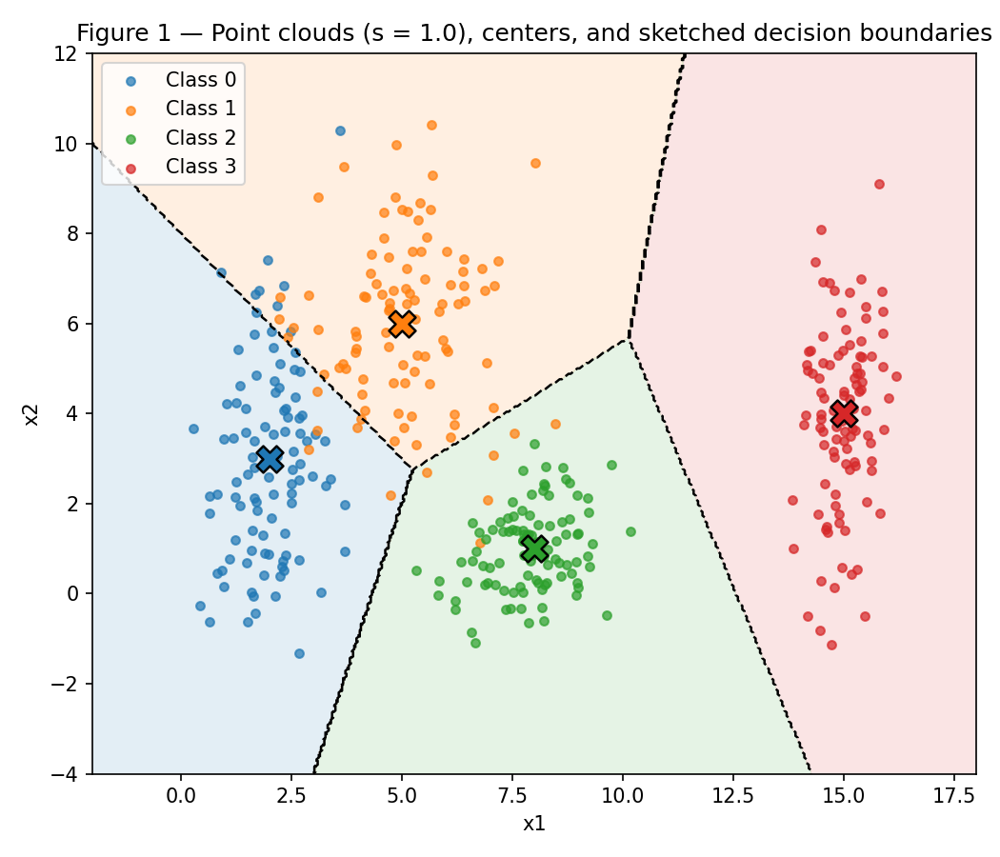
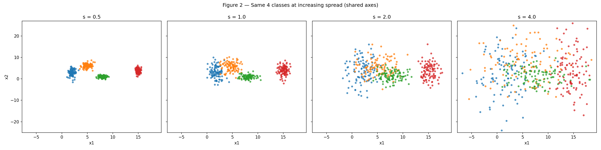
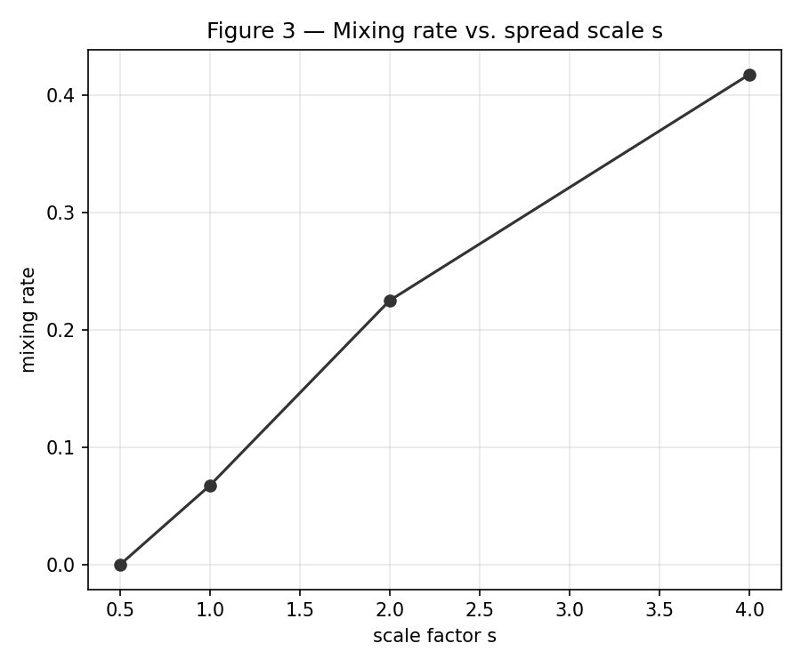
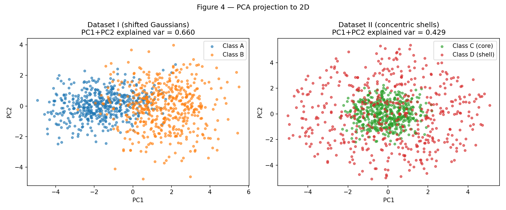
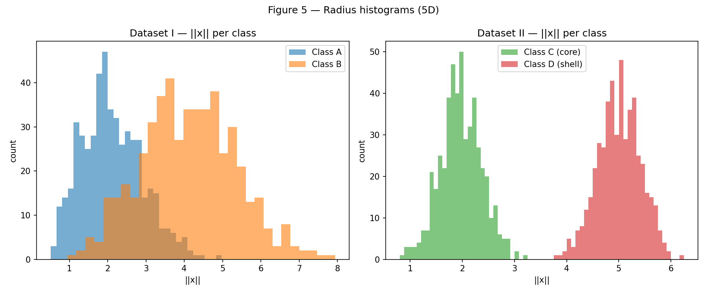
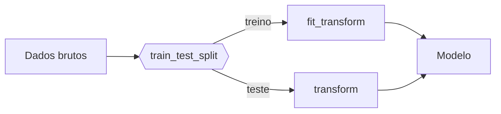
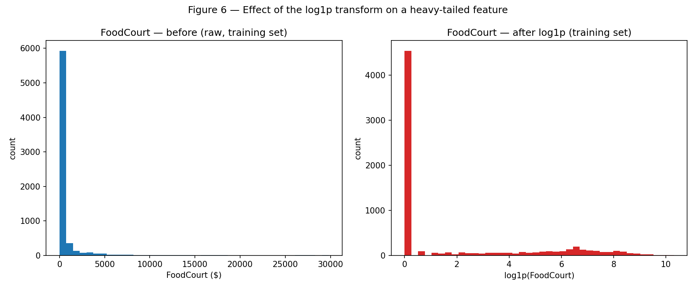

# 1. Data

!!! abstract "Enunciado"

    [Exercises → Data](https://insper.github.io/ann-dl/){:target='_blank'}

## Exercise 1

Para este exercício gerei quatro nuvens gaussianas 2D com `rng = np.random.default_rng(42)`, mantendo essa mesma seed em todo o resto do exercício. Depois regenerei as mesmas quatro classes em quatro níveis de dispersão diferentes para ver com que velocidade elas passam a se sobrepor, usando uma razão de separação geométrica e uma taxa de mistura por vizinho mais próximo. Nenhum modelo é treinado aqui — é só geometria.

### A — Generate the clouds

400 pontos no total, 100 por classe, gerados a partir das médias e desvios-padrão dados no enunciado.


/// caption
**Figura 1** — as quatro nuvens em s = 1.0. Centros marcados com um X, e também esbocei as regiões de vizinho-mais-próximo (linhas tracejadas) — é basicamente a fronteira que uma rede pequena aprenderia; reaproveito isso na parte C.
///

``` { .python .copy .select linenums='1' title="docs/exercises/data/code/ex1_point_clouds.py" }
--8<-- "docs/exercises/data/code/ex1_point_clouds.py"
```

### B — More or less spread out

As mesmas 4 classes, regeneradas quatro vezes com os desvios-padrão multiplicados por `s ∈ {0.5, 1.0, 2.0, 4.0}` (as médias não mudam).


/// caption
**Figura 2** — as quatro versões nos mesmos eixos, para comparação justa.
///

**Razão de separação r_ij em s = 1.0**, os 6 pares:

| Par (i, j) | r_ij |
|---|---|
| 0–1 | 1.326 |
| 0–2 | 2.480 |
| 0–3 | 4.496 |
| 1–2 | 2.380 |
| 1–3 | 3.642 |
| 2–3 | 3.542 |

O menor valor é o par (0, 1), com 1.326. Como as médias nunca se movem, r_ij escala como 1/s — então em s = 2 esse mesmo par cai para 1.326 / 2 = **0.663**, sem precisar regenerar nada.

**Taxa de mistura por escala** (fração de pontos cuja média mais próxima não é a da própria classe):

| s | taxa de mistura |
|---|---|
| 0.5 | 0.0000 |
| 1.0 | 0.0675 |
| 2.0 | 0.2250 |
| 4.0 | 0.4175 |


/// caption
**Figura 3** — taxa de mistura subindo de forma constante com s.
///

Onde a separabilidade linear realmente quebra? Em algum ponto entre s = 1 e s = 2. Em s = 1 o pior r_ij ainda é 1.326 — os dois centros mais próximos continuam mais distantes que a dispersão combinada deles. Em s = 2 essa mesma razão já caiu para 0.663, abaixo de 1: a dispersão passa a dominar a distância entre centros. E é exatamente aí que a taxa de mistura dá seu maior salto, de 6.75% para 22.5%. As duas medidas concordam.

### C — Analysis

1. Em s = 1, as classes 0 e 1 ficam bem próximas e se misturam um pouco (faz sentido, é o par com menor r_ij). A classe 2 fica abaixo delas, razoavelmente separada, e a classe 3 está bem à direita, isolada — sem problema nenhum ali. Uma única reta separaria as quatro classes? Não — é um problema de 4 classes e um hiperplano só divide o espaço em dois lados. Um conjunto de fronteiras lineares encadeadas já resolve bem, como dá para ver na Figura 1: três das quatro regiões saem limpas, e a única confusa é a fronteira 0/1, exatamente onde a sobreposição de fato acontece.
2. As linhas tracejadas na Figura 1 são esse esboço — regiões de vizinho-mais-próximo calculadas sobre as quatro médias. É uma aproximação razoável do que uma rede pequena aprenderia aqui, já que os clusters têm formatos parecidos entre si.
3. Ligando com a parte B: conforme s cresce, as nuvens incham e passam a invadir o território umas das outras, e a faixa em torno de cada fronteira fica mais grossa. É exatamente isso que a taxa de mistura está contando. Em s = 0.5 quase não há zona de sobreposição (mistura ~0%), mas em s = 4 quase metade dos pontos (41.75%) cai do lado "errado" do seu próprio centroide, porque nesse ponto a fronteira simplesmente não acompanha mais o quanto tudo se espalhou.

---

## Exercise 2

Dois datasets 5D aqui, 500 pontos por classe. O Dataset I é duas gaussianas multivariadas deslocadas, com estruturas de covariância diferentes. O Dataset II é duas "cascas" concêntricas — escolho uma direção aleatória na esfera unitária e depois um raio aleatório. Analisei os dois via projeção PCA e também diretamente em 5D.

### A — Dataset I: shifted Gaussians

Direto: `rng.multivariate_normal` com os `μ_A, Σ_A, μ_B, Σ_B` dados.

### B — Dataset II: concentric shells

Os vetores de direção vêm de `𝒩(0, I₅)`, normalizados para norma unitária. A Classe C (núcleo) usa raio `𝒩(2.0, 0.4)`, a Classe D (casca em volta) usa `𝒩(5.0, 0.4)`.

``` { .python .copy .select linenums='1' title="docs/exercises/data/code/ex2_nonlinearity.py" }
--8<-- "docs/exercises/data/code/ex2_nonlinearity.py"
```

### C — Visualize and compare


/// caption
**Figura 4** — os dois datasets projetados em 2D via PCA.
///

| | Variância explicada (PC1 + PC2) |
|---|---|
| Dataset I | 0.660 |
| Dataset II | 0.429 |

O Dataset I mantém bem mais informação nos dois primeiros componentes (66% contra 43%) e as classes continuam visivelmente separadas após a projeção — faz sentido, o PCA persegue a direção de maior variância e essa direção coincide com o deslocamento entre A e B. O Dataset II não tem essa sorte: suas duas classes parecem uma bolha só depois de achatadas em 2D, porque o que de fato as separa (o raio em relação à origem) não é a direção que o PCA valoriza.

**Em 5D, sem projeção nenhuma:**

| | Distância entre centros ‖μ₁ − μ₂‖ |
|---|---|
| Dataset I | 3.228 |
| Dataset II | 0.266 |


/// caption
**Figura 5** — histogramas de ‖x‖ por classe, nos dois datasets.
///

### D — Analysis

!!! note "Fronteiras não lineares"

    Para justificar por que as cascas concêntricas exigem fronteira não linear, ajuda escrever a condição de decisão. Um separador linear é

    $$
    f(\mathbf{x}) = \mathbf{w}^\top \mathbf{x} + b,
    $$

    enquanto a estrutura das cascas depende de $\lVert \mathbf{x} \rVert$, que não é expressável nessa forma.

1. Essa é a parte interessante do Dataset II: os centros estão quase sobrepostos (0.266 de distância, essencialmente zero por construção — as duas cascas são centradas na origem), e mesmo assim a Figura 5 mostra que os histogramas de raio não se sobrepõem em nada. Essa combinação é uma assinatura clara de estrutura radial. Um hiperplano funciona escolhendo uma direção e aplicando um limiar; quando as duas classes compartilham o centro, não existe direção em que uma classe fique sistematicamente mais longe que a outra — o sinal "perto da origem vs. longe da origem" simplesmente não é algo que uma projeção linear capta.
2. E é exatamente por isso que nenhum hiperplano resolve esse problema, não importa quantos dados a mais eu use. As duas classes são literalmente cascas aninhadas ao redor do mesmo centro. Um hiperplano corta o espaço em dois semi-espaços, mas cada semi-espaço ainda contém pontos em todos os raios — perto e longe — então ele sempre corta as duas cascas ao meio. É um problema de geometria, não de quantidade de dados.
3. Uma projeção PCA misturada prova que as classes são inseparáveis de verdade? Não, e esse dataset é um bom contraexemplo. O PCA só otimiza variância retida, não separação de classes, então é perfeitamente possível que ele descarte justamente a direção (ou, nesse caso, a quantidade não linear) que separa tudo. Aqui essa quantidade é `f(x) = ‖x‖² = Σᵢxᵢ²`. Calculando direto: o núcleo tem ‖x‖² médio ≈ 4.04 (máximo 10.54), a casca tem ≈ 25.21 (mínimo 14.08) — as faixas nem se tocam. Um limiar por volta de 12.3 separa os 1000 pontos sem nenhum erro, mesmo os mesmos pontos parecendo completamente misturados depois do PCA.

---

## Exercise 3

Usando o `train.csv` do Spaceship Titanic (8.693 linhas). Fiz o split antes de calcular qualquer estatística, depois imputação, encoding, um pouco de feature engineering, transformação log nas colunas enviesadas e por fim escalonamento — com cada etapa ajustada só no treino — para chegar em algo que uma camada oculta `tanh` consiga usar de verdade.

### A — Get to know the data

`Transported` é o alvo: se o passageiro foi ou não puxado para outra dimensão. É quase uma moeda honesta — **50.36% True / 49.64% False** — então não há desbalanceamento de classe para se preocupar.

**Tipos de feature**

- Numéricas: `Age`, `RoomService`, `FoodCourt`, `ShoppingMall`, `Spa`, `VRDeck`
- Categóricas: `HomePlanet`, `CryoSleep`, `Destination`, `VIP` (`Cabin`, `Name` e `PassengerId` são descartadas ou viram outra coisa — ver parte C)

**Valores ausentes**

| Coluna | Ausentes (contagem) | Ausentes (%) |
|---|---|---|
| CryoSleep | 217 | 2.50% |
| ShoppingMall | 208 | 2.39% |
| VIP | 203 | 2.34% |
| HomePlanet | 201 | 2.31% |
| Name | 200 | 2.30% |
| Cabin | 199 | 2.29% |
| VRDeck | 188 | 2.16% |
| FoodCourt | 183 | 2.11% |
| Spa | 183 | 2.11% |
| Destination | 182 | 2.09% |
| RoomService | 181 | 2.08% |
| Age | 179 | 2.06% |

Nada chama atenção — toda coluna fica entre 2% e 2.5% de ausência. Parece dropout aleatório espalhado, não um campo especificamente quebrado.

**Colunas de gasto**

| Coluna | Média | Mediana | Máximo |
|---|---|---|---|
| RoomService | 224.69 | 0.0 | 14.327 |
| FoodCourt | 458.08 | 0.0 | 29.813 |
| ShoppingMall | 173.73 | 0.0 | 23.492 |
| Spa | 311.14 | 0.0 | 22.408 |
| VRDeck | 304.85 | 0.0 | 24.133 |

Todas essas colunas têm mediana exatamente 0 enquanto a média fica na casa das centenas. A maioria dos passageiros simplesmente não gasta nada, e uma fatia pequena gasta muito (os máximos chegam a dezenas de milhares). Média bem acima da mediana é a assinatura clássica de uma distribuição enviesada e de cauda pesada — motivo da transformação log na parte C.

### B — Split before you transform

Split 80/20, estratificado por `Transported`, `random_state=42`.

Por que antes da imputação e do escalonamento? Porque as duas etapas calculam algo a partir dos dados — a mediana para preencher lacunas, a média/desvio para escalonar — e se esse "algo" for calculado usando linhas que o modelo vai ver no teste depois, o modelo já deu uma espiada no teste antes mesmo de começar a treinar. O split precisa vir primeiro para o teste continuar genuinamente não visto.

### C — Preprocess

``` { .python .copy .select linenums='1' title="docs/exercises/data/code/ex3_preprocessing.py" }
--8<-- "docs/exercises/data/code/ex3_preprocessing.py"
```

!!! warning "Vazamento de dados"

    O `train_test_split` vem **antes** de qualquer imputação, encoding ou escalonamento. Os transformadores são ajustados só no treino e aplicados ao teste.



1. **Dados ausentes.** Imputação por mediana nas colunas numéricas — robusta contra as caudas longas das colunas de gasto e contra idades estranhas — e por categoria mais frequente nas categóricas. Os dois imputadores são ajustados só no treino e depois aplicados ao teste.
2. **Encoding categórico.** One-hot encoding para `HomePlanet`, `CryoSleep`, `Destination`, `VIP`, usando `OneHotEncoder(handle_unknown="ignore")` ajustado nas categorias do treino. Se o teste trouxer uma categoria nunca vista no treino, ela simplesmente vira uma linha de zeros nessa feature em vez de quebrar o processo — o modelo não recebe sinal nenhum dela, em vez de o pipeline inteiro travar.
3. **Feature engineering.** `TotalSpend` é a soma, linha a linha, das cinco colunas de gasto (antes da transformação log, com `skipna=True` para as ausências não zerarem a soma toda). `Cabin`, `Name` e `PassengerId` são descartadas — são identificadores ou texto livre, não muito aproveitáveis do jeito que estão.
4. **Caudas pesadas.** `log1p` nas cinco colunas de gasto mais a `TotalSpend` recém-criada. A Figura 6 mostra o efeito disso em `FoodCourt`.
5. **Escalonamento.** Padronizei todo o bloco numérico (as 6 colunas originais + `TotalSpend`) para média 0, desvio 1, ajustado só no treino. Escolhi padronização em vez de espremer tudo em `[-1, 1]` porque, mesmo depois do log, as colunas de gasto ainda têm uma cauda, e um reescalonamento min/max rígido esmagaria os valores grandes (raros, mas legítimos) contra o limite.

### D — Verify and visualize


/// caption
**Figura 6** — `FoodCourt` no conjunto de treino, antes e depois do `log1p`. Antes, é basicamente um pico em 0 com uma cauda fina esticada até passar de 25.000. Depois, os mesmos dados ficam bem mais espalhados numa faixa utilizável — algo que uma unidade `tanh` consegue de fato usar, em vez de simplesmente ignorar quase tudo ou saturar nos valores raros e enormes.
///

**Checagens finais**

- NaNs restantes: **0**, tanto no treino quanto no teste.
- Formato final da matriz de features de treino: **(6954, 17)** — são 7 colunas numéricas padronizadas (as 6 originais + `TotalSpend`) mais 10 colunas one-hot (3 de `HomePlanet`, 2 de `CryoSleep`, 3 de `Destination`, 2 de `VIP`). A matriz de teste sai em (1739, 17).
- Faixa de valores: as colunas numéricas padronizadas vão de **-2.00 a 3.51** no treino (**-2.00 a 3.37** no teste); as colunas one-hot são só 0/1. Não é rigidamente limitado a [-1, 1], mas fica centrado em 0 com a maior parte dos valores a poucas unidades dele — deve ficar confortavelmente na parte não saturada do `tanh`.

**Reflexão.** Se eu tivesse que apontar a decisão de pré-processamento que mais importa para o treino, seria o `log1p` nas colunas de gasto. Sem ele, os valores brutos (a maioria 0, ocasionalmente na casa das dezenas de milhares) dominariam completamente a escala depois da padronização — um monte enorme de valores quase idênticos de um lado e alguns outliers extremos bem lá na região saturada do `tanh`. Isso pesa muito mais no comportamento do gradiente descendente do que, digamos, ter usado imputação por mediana em vez de por média.

---

## Results summary

| # | Item | Your value |
|---|---|---|
| 1 | Mixing rate at s = 0.5 | 0.0000 |
| 2 | Mixing rate at s = 1.0 | 0.0675 |
| 3 | Mixing rate at s = 2.0 | 0.2250 |
| 4 | Mixing rate at s = 4.0 | 0.4175 |
| 5 | Smallest r_ij at s = 1.0, and which pair | 1.326, pair (0, 1) |
| 6 | Distance between centers — Dataset I | 3.228 |
| 7 | Distance between centers — Dataset II | 0.266 |
| 8 | Explained variance PC1 + PC2 — Dataset I | 0.660 |
| 9 | Explained variance PC1 + PC2 — Dataset II | 0.429 |
| 10 | Share of the positive class in Transported | 50.36% (True) |
| 11 | Mean and median of FoodCourt on the training set, before transforming | mean 452.61, median 0.00 |
| 12 | Final shape of the training feature matrix | (6954, 17) |
| 13 | Minimum and maximum of the training and test sets after scaling | train [-2.00, 3.51], test [-2.00, 3.37] |

## Discussão

A parte que mais exigiu cuidado foi o Exercise 2: é fácil olhar a projeção PCA do Dataset II, ver que parece uma bolha misturada, e concluir errado que os dados são inseparáveis — só ficou claro que não é bem assim ao calcular `‖x‖²` diretamente em 5D e ver os intervalos das duas classes nem se tocarem. Se fosse refazer, teria calculado essa quantidade radial antes mesmo de olhar a projeção, em vez de depois — a ordem em que se olha para os dados muda bastante a intuição que se forma sobre eles.

## Conclusão

Os três exercícios mostram a mesma ideia de ângulos diferentes: a complexidade da fronteira de decisão que uma rede precisa aprender vem da geometria dos dados, não do quanto de dado existe. No Exercise 1, mais dispersão empurra um problema linear para a beira da não-linearidade. No Exercise 2, a estrutura radial do Dataset II é fundamentalmente não linear, não importa quantos pontos se adicione. E no Exercise 3, mesmo antes de qualquer rede entrar em cena, decisões de pré-processamento — sobretudo lidar com a cauda pesada das colunas de gasto — já determinam se as features chegam numa forma que a rede consegue de fato aproveitar.
