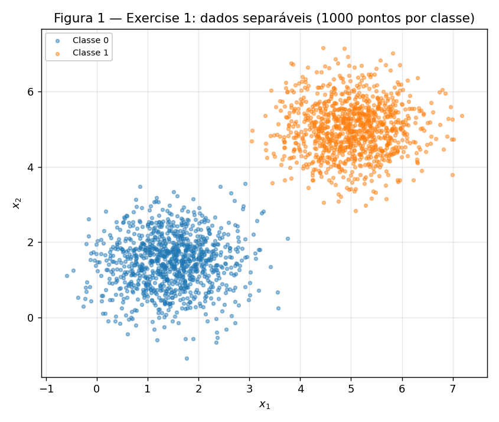
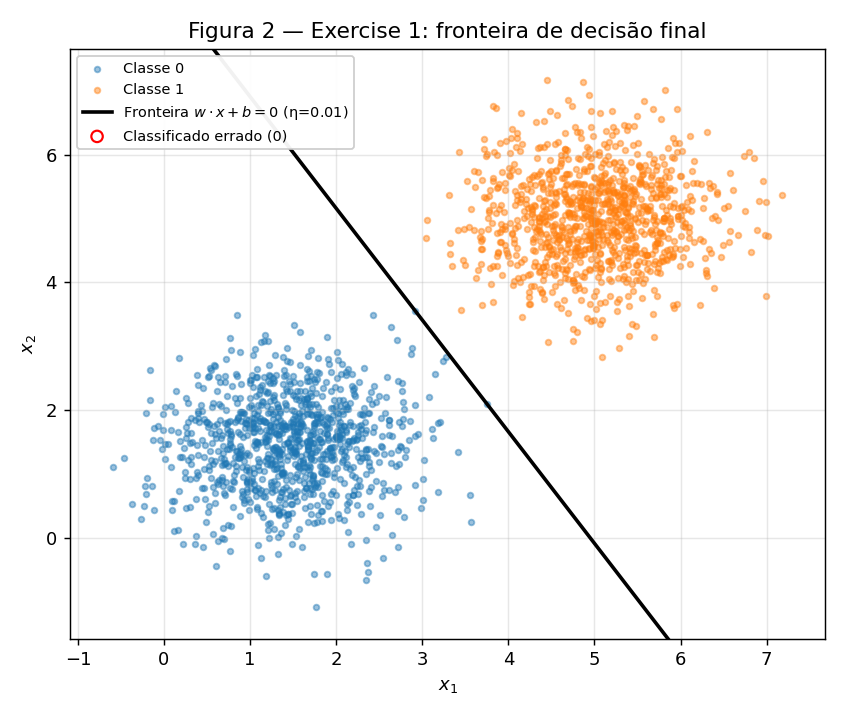
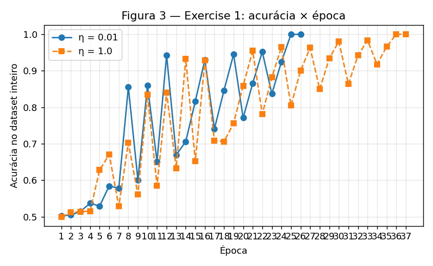
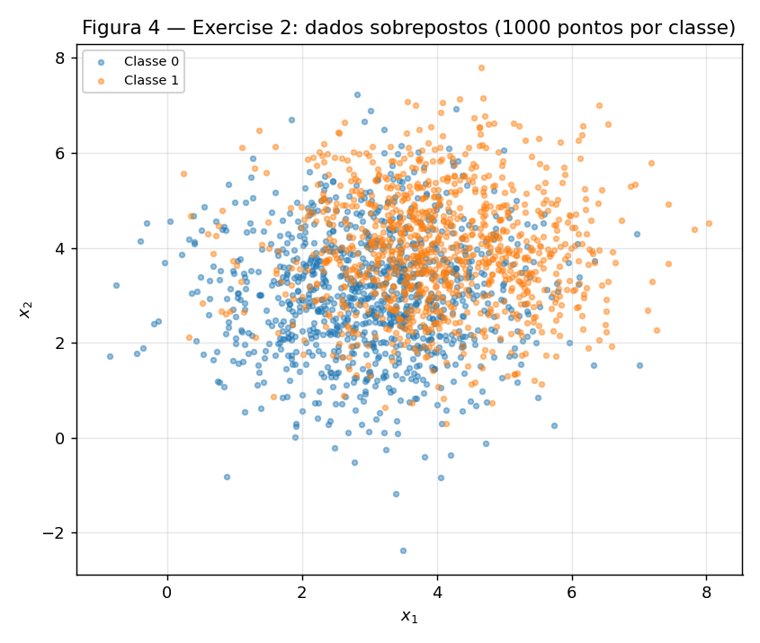
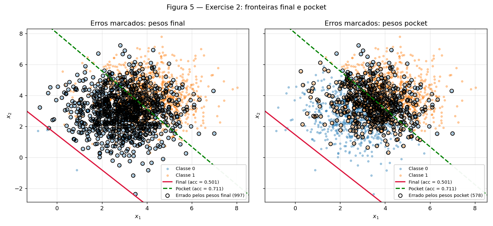
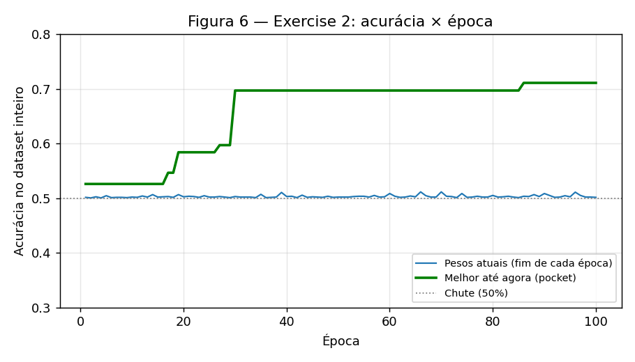

# 2. Perceptron

!!! abstract "Enunciado"

    [Exercises → Perceptron](https://insper.github.io/ann-dl/){:target='_blank'}

**Implementação.** Todo o relatório sai de um único script,
`code/perceptron_report.py`, que usa **um único** gerador `rng = np.random.default_rng(42)`
do começo ao fim (dados do Ex. 1 → pesos iniciais do Ex. 1 → dados do Ex. 2 → pesos iniciais
do Ex. 2). O perceptron é uma classe escrita à mão com `numpy` (função degrau, predição, regra
de atualização e loop de treino); os gráficos usam `matplotlib`. Nenhum modelo de
scikit-learn é usado. A **mesma classe** é usada nos dois exercícios; no Ex. 2 só se liga o
parâmetro `pocket=True`, que acrescenta a cópia de `(w, b)` para o "bolso" dentro do loop.

**Ordem das amostras.** As amostras são percorridas na ordem de geração — as 1000 da
Classe 0 e depois as 1000 da Classe 1 — sem embaralhar, a mesma ordem em todas as épocas e em
todas as execuções. Isso deixa a comparação entre as duas execuções com η diferente exata
("mudando nada além de η") e, como fica claro no Exercise 2, influencia bastante o que se vê
ao fim de cada época.

**Desafios.** (i) A contagem de épocas: o critério de parada só é verificado com uma passada
completa sem atualizações, então o número reportado **inclui** essa última época "limpa".
(ii) No Exercise 2 o resultado de ~50% parece bug; precisei acompanhar o estado dos pesos
*dentro* de uma época para entender o ciclo que produz esse número (item 2.D).

Para reproduzir: `cd docs/exercises/perceptron/code && python perceptron_report.py`.

??? example "Script completo — `code/perceptron_report.py`"

    ``` { .python .copy linenums='1' }
    --8<-- "docs/exercises/perceptron/code/perceptron_report.py"
    ```

## Exercise 1

### A — Generate the data

Duas gaussianas 2D com 1000 amostras cada: Classe 0 com média $[1.5, 1.5]$ e Classe 1 com
média $[5, 5]$, ambas com covariância $\begin{bmatrix}0.5&0\\0&0.5\end{bmatrix}$.

``` { .python .copy linenums='1' title="Geração dos dados (perceptron_report.py)" }
--8<-- "docs/exercises/perceptron/code/perceptron_report.py:data"
```


/// caption
**Figura 1** — os 2000 pontos do Exercise 1. As nuvens estão bem separadas: a distância
entre as médias ($\approx 4.95$) é cerca de 7 vezes o desvio-padrão de cada eixo ($\approx 0.71$).
///

### B — Implement the perceptron

- **Predição:** $\hat y = \text{step}(w\cdot x + b)$, com $\text{step}(z)=1$ se $z\ge 0$ e $0$ caso contrário.
- **Atualização** (rótulos $\{0,1\}$): $w \leftarrow w + \eta\,(y-\hat y)\,x$ e $b \leftarrow b + \eta\,(y-\hat y)$.
  O erro $(y-\hat y)$ é $0$ num acerto (nenhuma atualização), $+1$ num falso negativo e $-1$ num falso positivo.
- **Inicialização:** $w \sim \mathcal N(0, 0.01^2)$ via `rng.normal(0, 0.01, size=2)`, $b = 0$.
  Sorteado: $w_0 = [0.00253,\ 0.00895]$.
- **Taxa de aprendizado:** $\eta = 0.01$.
- **Parada:** uma época inteira sem atualizações, ou 100 épocas. A acurácia no dataset
  inteiro é registrada ao final de cada época.

``` { .python .copy linenums='1' title="Perceptron (perceptron_report.py)" }
--8<-- "docs/exercises/perceptron/code/perceptron_report.py:perceptron"
```

### C — Train and measure

``` { .python .copy linenums='1' title="Treino do Exercise 1 (perceptron_report.py)" }
--8<-- "docs/exercises/perceptron/code/perceptron_report.py:ex1"
```

Resultado com $\eta = 0.01$:

| Quantidade | Valor |
|---|---|
| $w$ final | $[0.05050,\ 0.02887]$ |
| $b$ final | $-0.25$ |
| Épocas | **26** (25 com atualizações + 1 passada limpa que confirma a convergência) |
| Acurácia final | **100.0%** (2000/2000) |
| Total de atualizações | 73 |

A fronteira é a reta $x_2 = -1.749\,x_1 + 8.659$.


/// caption
**Figura 2** — fronteira $w\cdot x + b = 0$ após o treino. Pontos classificados errado
seriam circulados em vermelho: não há nenhum (0 erros).
///


/// caption
**Figura 3** — acurácia no dataset inteiro ao final de cada época, para $\eta=0.01$ (26 épocas)
e para $\eta=1.0$ (37 épocas, item D). As duas curvas terminam em 1.0 e param.
///

### D — Analysis

**1. Por que dados separáveis convergem rápido?** Pela regra de atualização, só um erro
muda os pesos: quando $\hat y = y$, o termo $(y-\hat y)$ é zero. Assim que a reta passa entre
as duas nuvens, quase todos os pontos já estão do lado certo e param de gerar atualizações;
só os poucos pontos perto da fronteira ainda erram. Os números mostram isso: foram
**73 atualizações em 26 épocas**, contra 52 000 visitas a amostras. As atualizações por
época foram 3, 3, 4, 4, 3, …, 2, 3, **1, 0**: nunca mais que 4, e depois caíram a zero.
Esse é o teorema de convergência do perceptron em ação: se existe uma reta que separa as
classes com margem $\gamma > 0$ e $\|x\| \le R$, o número **total** de erros é no máximo
$(R/\gamma)^2$, ou seja, finito. Com as nuvens tão afastadas, a margem é grande e a conta
fecha em poucas dezenas de erros. O zigue-zague da Figura 3 no começo (por exemplo, 85.6% → 60.1%
→ 86.0%) vem da ordem das amostras (bloco da Classe 0, depois bloco da Classe 1): um único
erro perto do fim da época desloca a reta bastante enquanto $\|w\|$ ainda é pequeno. Mas
cada erro deixa a reta mais perto de uma separadora, até a passada limpa.

**2. Rodando de novo com $\eta = 1.0$** (mesmos dados, mesma ordem, mesmo $w_0$, mesmo $b_0=0$):

| | $\eta = 0.01$ | $\eta = 1.0$ |
|---|---|---|
| $w$ final | $[0.05050,\ 0.02887]$ | $[5.87062,\ 3.35924]$ |
| $b$ final | $-0.25$ | $-31.0$ |
| Épocas | 26 | **37** |
| Acurácia final | 100% | **100%** |
| Direção $w/\|w\|$ | $[0.86812,\ 0.49635]$ | $[0.86795,\ 0.49665]$ |
| Fronteira | $x_2 = -1.749\,x_1 + 8.659$ | $x_2 = -1.748\,x_1 + 9.228$ |
| Distância da fronteira à origem $\lvert b\rvert/\|w\|$ | 4.298 | 4.583 |

As duas chegam a 100%, mas por fronteiras diferentes. Aqui as direções ficaram quase
iguais (ângulo de $0.02^\circ$ entre elas). A diferença está no deslocamento: com $\eta=1.0$
a reta fica mais afastada da origem (distância 4.58 contra 4.30). Na prática ela está mais perto da
Classe 1, e com $\eta=0.01$ mais perto da Classe 0. As trajetórias também foram diferentes:
26 contra 37 épocas.

**O que $\eta$ controla.** Depois de $t$ atualizações,
$w_t = w_0 + \eta\sum_{k}(y_k-\hat y_k)\,x_k = \eta\left(\tfrac{w_0}{\eta} + \sum_k (y_k-\hat y_k)\,x_k\right)$
(o mesmo vale para $b$, com $b_0 = 0$). Multiplicar tudo por $\eta>0$ não muda o sinal de
$w\cdot x + b$, então as predições dependem só de $w_0/\eta$. Em outras palavras, $\eta$ não
controla "a velocidade". Ele controla **quanto pesa o chute inicial em relação a cada passo**.
Com $\|w_0\|\approx 0.0093$ e $\|x\|$ entre 2 e 7:

- $\eta = 0.01$: cada passo soma $0.01\,x$ (norma de ~0.02 a 0.07), da mesma ordem de $w_0$.
  O chute aleatório influencia as primeiras predições e muda a trajetória.
- $\eta = 1.0$: cada passo soma $x$ inteiro (norma de ~2 a 7), umas 500 vezes maior que $w_0$.
  O chute inicial vira ruído e o treino se comporta praticamente como se partisse de zero.
  De fato, a execução com $\eta=1.0$ dá **as mesmas 37 épocas** e quase os mesmos pesos
  ($[5.8706,\ 3.3592]$ contra $[5.8681,\ 3.3503]$, $b=-31$ nos dois) da execução com $w_0 = 0$ abaixo.

**3. E se partíssemos de $w = 0,\ b = 0$?** Sejam $(w_t^{(\eta)}, b_t^{(\eta)})$ os pesos
depois de $t$ amostras visitadas com taxa $\eta$, e $(v_t, c_t)$ os pesos da mesma execução
com $\eta = 1$. **Afirmação:** $w_t^{(\eta)} = \eta\,v_t$ e $b_t^{(\eta)} = \eta\,c_t$ para todo $t$.

*Prova por indução.* Base: $w_0^{(\eta)} = 0 = \eta\cdot 0$ e $b_0^{(\eta)} = 0 = \eta\cdot 0$.
Passo: supondo que vale para $t$, a predição na amostra $x_t$ é

$$
\hat y_t^{(\eta)} = \text{step}\!\left(\eta\,v_t\cdot x_t + \eta\,c_t\right)
= \text{step}\!\left(\eta\,(v_t\cdot x_t + c_t)\right)
= \text{step}\!\left(v_t\cdot x_t + c_t\right) = \hat y_t^{(1)},
$$

porque $\eta > 0$ não muda o sinal do argumento (e o zero continua zero, então o caso
$z = 0 \Rightarrow 1$ também se preserva). Com o mesmo erro $e_t = y_t - \hat y_t$ nas duas execuções:

$$
w_{t+1}^{(\eta)} = \eta\,v_t + \eta\,e_t\,x_t = \eta\,(v_t + e_t\,x_t) = \eta\,v_{t+1},
\qquad
b_{t+1}^{(\eta)} = \eta\,c_t + \eta\,e_t = \eta\,c_{t+1}. \quad\blacksquare
$$

Então, para duas taxas $\eta_1$ e $\eta_2$, $w^{(\eta_2)} = \tfrac{\eta_2}{\eta_1}\,w^{(\eta_1)}$
e $b^{(\eta_2)} = \tfrac{\eta_2}{\eta_1}\,b^{(\eta_1)}$ em **todo** passo. As duas execuções
erram exatamente nas mesmas amostras, na mesma ordem. Logo têm o mesmo número de épocas, e a
fronteira $\{x : w\cdot x + b = 0\}$ é a mesma (multiplicar a equação por uma constante
positiva não muda a reta). $\eta$ não teria efeito nenhum, e é por isso que o item B proíbe
começar do zero. A verificação numérica no código confirma:

| Início em $w=0,\ b=0$ | $w$ final | $b$ final | Épocas |
|---|---|---|---|
| $\eta_1 = 0.01$ | $[0.058681,\ 0.033503]$ | $-0.31$ | 37 |
| $\eta_2 = 1.0$ | $[5.868084,\ 3.350287]$ | $-31.0$ | 37 |
| Razão | $[100.000,\ 100.000]$ | $100.000$ | = |

---

## Exercise 2

### A — Generate the data

Duas gaussianas 2D com 1000 amostras cada: Classe 0 com média $[3, 3]$ e Classe 1 com média
$[4, 4]$, ambas com covariância $\begin{bmatrix}1.5&0\\0&1.5\end{bmatrix}$. É a mesma função
`make_dataset` do Exercise 1, chamada com o mesmo `rng`, que continua de onde parou.


/// caption
**Figura 4** — os 2000 pontos do Exercise 2. A distância entre as médias ($\approx 1.41$) é
menor que o desvio-padrão de cada eixo ($\approx 1.22$): as nuvens se sobrepõem muito e
nenhuma reta as separa.
///

### B — Train, keeping the best weights

A mesma classe `Perceptron`, sem mudanças, com $\eta = 0.01$, limite de 100 épocas e
$w_0$ sorteado do mesmo `rng` ($w_0 = [0.01216,\ -0.00451]$, $b_0=0$). A única diferença é
`pocket=True`: depois de **cada** atualização, a acurácia no dataset inteiro é calculada e, se
for a maior já vista, $(w, b)$ é copiado para o bolso.

``` { .python .copy linenums='1' title="Treino do Exercise 2 (perceptron_report.py)" }
--8<-- "docs/exercises/perceptron/code/perceptron_report.py:ex2"
```

O loop rodou as **100 épocas** (nunca houve uma época sem atualização) e fez 289 atualizações no total.

| Pesos | $w$ | $b$ | Acurácia |
|---|---|---|---|
| **Final** (após a época 100) | $[0.05448,\ 0.04804]$ | $-0.07$ | **50.15%** |
| **Pocket** (melhor até agora) | $[0.01066,\ 0.00873]$ | $-0.07$ | **71.10%** (achado na época 86) |

Para comparar: o melhor limiar possível sobre a direção que liga as médias ($x_1+x_2$) acerta
71.75% destes pontos, e o ótimo teórico para essas duas gaussianas é
$\Phi\!\left(\tfrac{\|\mu_1-\mu_0\|}{2\sigma}\right) = \Phi(0.577) \approx 71.8\%$. O pocket chegou
a menos de 1 ponto percentual do melhor que uma reta consegue.

### C — Figures


/// caption
**Figura 5** — as duas fronteiras sobre os dados: final (vermelha, contínua) e pocket (verde,
tracejada). À esquerda estão circulados os 997 pontos que os pesos **finais** erram; à direita, os
578 que os pesos **pocket** erram. A fronteira final fica toda fora da nuvem, embaixo à
esquerda, e por isso quase toda a Classe 0 é marcada como erro.
///


/// caption
**Figura 6** — acurácia dos pesos atuais ao fim de cada época (azul) e melhor acurácia já vista,
o pocket (verde). A curva azul fica colada em 50% as 100 épocas; a verde sobe em degraus até 71.1%.
///

### D — Analysis

**1. Por que o final fica em ~50% e o pocket em ~71%?**

*Onde está a fronteira final.* A reta final corta a diagonal $x_1 = x_2$ em $(0.68,\ 0.68)$ e
está a **3.98 unidades** do centro dos dados, $(3.5,\ 3.5)$: fica inteira embaixo e à esquerda
da nuvem (Figura 5). Com isso, **99.85%** dos pontos caem do lado "Classe 1". O modelo final
praticamente chuta "1" para todo mundo, e acerta só a metade que de fato é Classe 1: 50.15%.

*Por que o treino a deixa lá.* São só 2 a 5 atualizações por época, e acompanhando os pesos
dentro de uma época dá para ver um ciclo:

1. A época começa com o estado "tudo é Classe 1". A **primeira amostra da Classe 0** é erro:
   $w \leftarrow w - \eta x$ e $b \leftarrow b - \eta$. Com $\|x\|\approx 5$, o passo em $w$ tem
   norma ~0.05, do tamanho do próprio $w$ ($\|w\|\approx 0.07$), enquanto $b$ anda só 0.01.
   $w$ praticamente zera (medido: $w \approx [0.0039,\ 0.0006]$, $b = -0.08$) e agora
   $w\cdot x + b < 0$ para todo mundo: o modelo passa a dizer "tudo é Classe 0" (acurácia 50%).
2. O resto do bloco da Classe 0 é acerto, então nada muda.
3. A **primeira amostra da Classe 1** é erro: $w \leftarrow w + \eta x$ e $b \leftarrow b + \eta$.
   $w$ volta a crescer ~0.05, $b$ sobe só 0.01, e o modelo volta a dizer "tudo é Classe 1".
   O resto do bloco da Classe 1 é acerto, e a época acaba nesse estado.

A dica do enunciado explica o ciclo. Cada erro move $b$ em $\eta = 0.01$, mas move $w$ em
$\eta\|x\| \approx 0.05$ (aqui $\overline{\|x\|} = 5.11$), **cinco vezes mais**. A reta
$w\cdot x + b = 0$ fica a uma distância $|b|/\|w\|$ da origem. Para passar pelo meio da nuvem,
com $x_1 + x_2 \approx 7$, seria preciso $b \approx -3.5\,(w_1+w_2) \approx -0.36$. Isso exigiria
uns 30 erros "de Classe 0" a mais que "de Classe 1". Mas cada bloco gera mais ou menos um erro
de cada tipo, que se cancelam em $b$: $b$ fica oscilando perto de $-0.07$ (o mesmo valor no
final e no pocket). Então $|b|/\|w\| \approx 1$ e a reta fica perto da origem, muito antes da nuvem
($\|x\|\approx 5$). Cada erro só faz a reta **pular por cima da nuvem inteira**, de um lado
para o outro. O snapshot do fim da época é sempre o lado "tudo 1".

*Por que o pocket escapa.* O pocket avalia os pesos depois de **cada** atualização, não só no
fim da época. Em algum momento (época 86) ele pegou um estado intermediário em que $w$ tinha
sido parcialmente cancelado ($\|w\| = 0.0138$) sem mudar de direção, e com esse $\|w\|$ pequeno
o mesmo $b = -0.07$ coloca a reta em $x_1 + x_2 = 7.2$: no meio da nuvem, perpendicular à direção
que liga as médias. É quase a reta ótima (71.1% contra 71.75%). O pocket não aprende nada a
mais, só **guarda** o melhor estado por onde o ciclo passou.

**2. Figura 3 × Figura 6 e o teorema de convergência.** Na Figura 3 as atualizações vão a zero
e a curva para em 100%. Na Figura 6 nunca há época sem atualização (mínimo de 2 por época), e
a curva azul não converge: fica entre 50.1% e 51.2% nas últimas 50 épocas, sem tendência.

O **teorema de convergência do perceptron** (Novikoff) garante: *se* os dados são
**linearmente separáveis com margem** $\gamma > 0$ (existe $w^*$ com $\|w^*\|=1$ e todas as amostras do
lado certo, a pelo menos $\gamma$ da reta) e $\|x\|\le R$, então o perceptron faz no máximo $(R/\gamma)^2$
erros e para depois de um número finito de épocas. **O que este dataset viola é a
separabilidade linear.** As gaussianas se sobrepõem, então não existe reta sem erros (a
melhor erra ~28%) e não existe margem $\gamma > 0$. Sem essa hipótese o teorema não garante
nada: nem que o loop pare, nem que chegue perto da melhor reta. O perceptron não minimiza o
número de erros. Ele só reage ao último erro que viu.

**3. Mais épocas resolvem? E um $\eta$ menor?** Nenhum dos dois.

- **Mais épocas: não.** A regra só mexe nos pesos quando há erro, e com dados não separáveis
  *todo* conjunto de pesos erra alguma amostra. Então toda época tem pelo menos uma
  atualização e o loop nunca para por conta própria. Pior: a dinâmica é um ciclo. Cada
  época repete o padrão "erro na 1ª amostra da Classe 0 → tudo 0 → erro na 1ª amostra da
  Classe 1 → tudo 1", e o estado ao fim da época cai sempre no mesmo tipo de configuração.
  Não há nada acumulando em direção à reta ótima: o pouco que $b$ anda é desfeito no bloco
  seguinte. A Figura 6 mostra isso, com as épocas 50–100 idênticas às épocas 1–50.
- **$\eta$ menor: não.** No Exercise 1.D ficou provado que, a partir de $w=0,\ b=0$, $\eta$
  apenas multiplica $w$ e $b$ pela mesma constante e gera **exatamente** a mesma sequência de
  predições. Aqui $\|w_0\|\approx 0.013$ é da ordem de um passo, então o argumento vale quase
  exatamente. O ponto central é que a **razão** entre o passo de $b$ e o passo de $w$ é
  $\eta : \eta\|x\| = 1 : \|x\|$, que não depende de $\eta$. Diminuir $\eta$ encolhe os pulos,
  mas encolhe $b$ e $w$ na mesma proporção, e a reta continua pulando por cima da nuvem. O
  que resolveria é mudar o algoritmo, não os hiperparâmetros: o próprio pocket, o perceptron
  com média dos pesos, ou um modelo treinado minimizando uma perda (como a regressão logística).

---

## Results summary

| # | Quantity | Value |
|---|---|---|
| 1 | Exercise 1 — final $w$ and $b$ | $w = [0.05050,\ 0.02887]$, $b = -0.25$ |
| 2 | Exercise 1 — epochs to convergence | 26 (25 com atualizações + 1 passada limpa) |
| 3 | Exercise 1 — final accuracy | 100.0% |
| 4 | Exercise 1 — epochs and final accuracy with $\eta=1.0$ | 37 épocas, 100.0% |
| 5 | Exercise 2 — final $w$ and $b$ | $w = [0.05448,\ 0.04804]$, $b = -0.07$ |
| 6 | Exercise 2 — accuracy of the final weights | 50.15% |
| 7 | Exercise 2 — accuracy of the pocket weights | 71.10% ($w = [0.01066,\ 0.00873]$, $b = -0.07$) |
| 8 | Exercise 2 — epoch at which the pocket best occurred | 86 |
